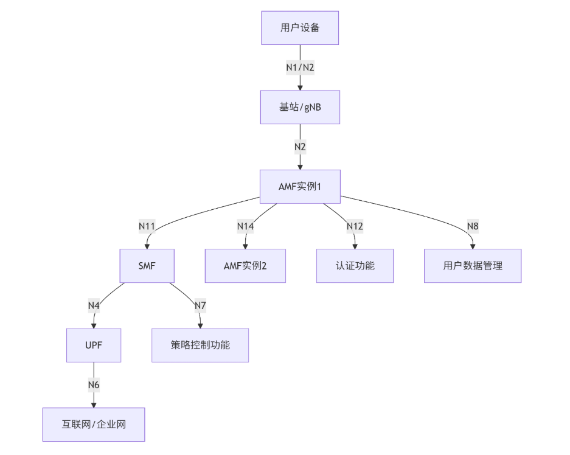
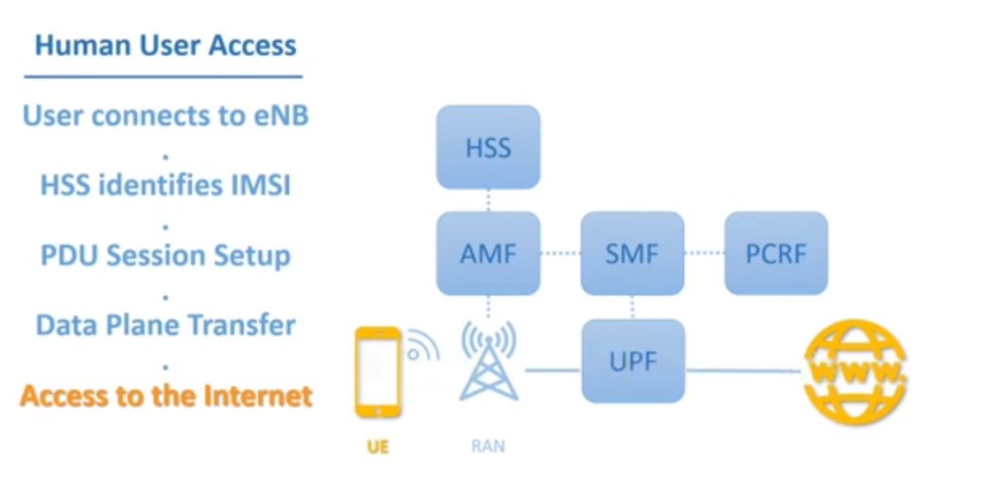
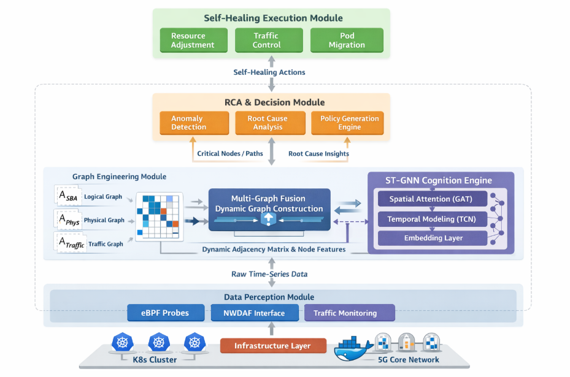

### 核心网主要网元架构


#### 网元流程



自愈系统设计为预测驱动的闭环控制系统，通过 ST-GNN 进行风险传播建模与根因定位，结合策略引擎生成扩容、迁移或资源重配置动作，并通过自定义 Controller 调用 K8s API 执行，最终实现闭环自愈。


### 核心网K8s网络配置
#### **Pod 资源请求与限制**
**核心网/边缘计算:** 5G UPF、AMF、SMF 等网元对 CPU 和内存有严格要求。**请求 (Requests)** 确保 Pod 获得足够的资源，**限制 (Limits)** 防止单个 Pod 耗尽节点资源。

```
resources:
  requests:
    cpu: "1000m" # 1 core
    memory: "2Gi"
  limits:
    cpu: "2000m" # 2 cores
    memory: "4Gi"
```

 **核心网/边缘计算:** 保证高可用和性能。
 - **Pod Affinity:** 强制让互为依赖的网元（如 SMF-UPF）尽可能部署在**同一节点**或**同一可用区**，降低时延。
- **Pod Anti-Affinity:** 确保关键网元（如两个 AMF 实例）**不在同一节点**，防止单点故障。

```
affinity:
  podAffinity:
    requiredDuringSchedulingIgnoredDuringExecution:
      labelSelector:
        matchExpressions:
          - key: app
            operator: In
            values:
              - smf
      topologyKey: "kubernetes.io/hostname" # 强制同节点
  podAntiAffinity:
    preferredDuringSchedulingIgnoredDuringExecution:
      - weight: 100
        podAffinityTerm:
          labelSelector:
            matchExpressions:
              - key: app
                operator: In
                values:
                  - amf
          topologyKey: "kubernetes.io/hostname" # 尽量不同节点
```


**解释：当前 Pod 必须被调度到“已经运行了 `app=smf` Pod 的节点上， 调度器会尽量把当前 Pod 调度到“没有 `amf` Pod 的节点上”，  但如果实在没有这样的节点，也会妥协。


#### 网络配置
5G 的 UPF（用户面功能）是一个“流量怪兽”。它需要：
1. **N3 接口**：对接基站（GTP-U 流量）。
2. **N4 接口**：对接 SMF（控制信令）。
3. **N6 接口**：对接外部数据网络（Internet/MEC）。
4. **极低时延**：不能忍受内核协议栈的多次拷贝。

```
apiVersion: "cilium.io/v2"
kind: CiliumNetworkPolicy
metadata:
  name: allow-amf-to-smf-n11
spec:
  endpointSelector:
    matchLabels:
      app: smf
  ingress:
  - fromEndpoints:
    - matchLabels:
        app: amf
    toPorts:
    - ports:
      - port: "8080"
        protocol: TCP
      rules:
        http:
        - method: "POST"
          path: "/nsmf-pdusess/v1/pdu-sessions" # 仅允许创建会话的 API
```


##### **问题一：**5G-A核心网的“动态拓扑”具体是指什么场景？**
**回答：**5G-A 核心网的“动态拓扑”并不只是网元频繁上下线，而是用户面流量路径、控制面服务关系以及切片逻辑视图在运行期持续重构。这使得传统基于静态拓扑图、设备级告警和人工经验的运维方式失效，运维对象必须从“网元”转向“会话路径 + 策略决策 + 时间维度的拓扑演化”。



##### 问题二：**在 ST-GNN 中，你是如何定义“图（Graph）”的结构的？**

回答：这里我们设计了三种图结构进行预测的，第一种是网元之间的连接关系，UE发送信号通过AMF网元接收，并将用户数据存储在UDM网元中，AMF与SMF与PCRF之间完成策略分配，SMF与UPF用户面之间连接到互联网。这是我们的业务逻辑结构。第二个构图方式是通过物理之间的 连接关系，两个网元是否位于同一个机房，是否通过同一个服务器进行连接，之间经过了几个路由器，通过计算两个网元之间的时延进行关系的连接。第三个构图方式是通过计算两个网元在此时此刻是否强相关，这是根据一段时间内的历史流量进行皮尔斯相关性检验得出的。

同一个物理机房的交换机故障或过载，会导致该机房内部所有网元（即使逻辑上不直接相连）的流量同时出现异常


在相关性的构图中，为了稀疏化矩阵，加速卷积过程，
- **稀疏化处理**：我们并没有保留全连接矩阵，而是设置了阈值（Thresholding），只保留相关性大于 0.8 的强相关边，让矩阵稀疏化，加速图卷积运算。
- **计算频率优化**：虽然流量是分钟级预测，但图结构不需要每分钟重算。我们采用了**滑动窗口**机制，或者每隔 T 分钟（如15分钟）更新一次图结构，因为网元间的流量模式变化通常具有一定的惯性，不需要每秒都变。


##### 问题三：在配置 Pod 反亲和性（Anti-Affinity）时，使用的 topologyKey 是什么？不同的 Key 有什么区别？

- 如果 Key 是 kubernetes.io/hostname：表示互斥的 Pod 不能在同一台**节点（Node）**上（解决单机故障）。
- 如果 Key 是 topology.kubernetes.io/zone：表示互斥的 Pod 不能在同一个**可用区（Zone）**（解决机房/机架级故障）。


##### 问题四：**使用了反亲和性后，是配置的“硬策略”（Required）还是“软策略”（Preferred）？如果资源不足导致调度失败怎么办？**

**亲和性：**调度器优先将pod调度到满足条件的节点上


**反亲和性：**调度器避免将pod调度到满足条件的节点上
控制面要坚持硬反亲和，因为核心网元如果调度到同一节点，要求Required策略，如果出现问题可能意味着重大事故，而用户面不坚持硬反亲和，因为用户面连接数多，倾向于Preferred 策略，在资源紧张时允许降级运行，通过会话级调度和多路径能力兜底。


##### 问题五：如果你全用了“硬策略”，资源紧张时 Pod 会一直 Pending。你如何解决这个问题？（回答方向：配置优先级 PriorityClass，让核心网元抢占资源；或者采用软策略+权重）。
**如果全采用 Required 级反亲和，必须同步引入 PriorityClass 和抢占机制，否则 Pod Pending 是必然结果。**
**工程上更稳的做法是：控制面使用硬反亲和 + 高优先级 + 专用 Node Pool；用户面采用软反亲和，通过权重在资源紧张时允许降级调度。**
**这不是 Kubernetes 技巧问题，而是对核心网业务等级和调度语义是否理解到位的问题。**

**preemptionPolicy**  驱逐低优先级的pod
```
apiVersion: scheduling.k8s.io/v1
kind: PriorityClass
metadata:
  name: core-network-high
value: 100000
preemptionPolicy: PreemptLowerPriority
globalDefault: false
```


##### 问题六：5G 网元启动通常比较慢，你是如何配置探针（Probes）的？Liveness 和 Readiness 有什么区别？

| 探针           | 失败后果                     | 适合判断什么   | 5G 场景建议  |
| ------------ | ------------------------ | -------- | -------- |
| Liveness     | **直接重启容器**               | 是否“不可恢复” | 极少使用     |
| Readiness    | 从 Service / Endpoint 中摘除 | 是否可承载业务  | 核心使用     |
| StartupProbe | 启动期豁免 Liveness           | 是否完成初始化  | **强烈推荐** |

由于 5G 网元启动过程长且依赖复杂，必须显式使用 StartupProbe 来屏蔽启动期误重启；  
Liveness 只用于判断不可恢复的进程异常；  
Readiness 才是控制业务接入的核心手段。


5G 核心网是强耦合时空系统，单点指标无法反映未来风险。
通过 ST-GNN 建模拓扑依赖 + 时间趋势，可以提前识别负载传导路径，实现预测式调度与 SLA 保障。


**节点池分层**：划分 general、high-performance、dpdk、gpu 等节点池.


**给结点打标签**：
```
节点 A：插了 Intel E810 网卡，专门做转发
kubectl label node node-a pool=dpdk-sriov
kubectl taint node node-a workload=data-plane:NoSchedule # 闲杂人等（普通Pod）禁入

节点 B：普通 x86 服务器，做控制面
kubectl label node node-b pool=control-plane
```


```
spec:
  nodeSelector:
    pool: dpdk-sriov
  tolerations: # 只有拿着“通行证”的 UPF 才能进入被 Taint 的高性能节点
  - key: "workload"
    operator: "Equal"
    value: "data-plane"
    effect: "NoSchedule"
```

**dpdk-sriov** ： 只有带有标签 `pool=dpdk-sriov` 的节点，Pod 才能被调度到。
**tolerations**： 所有的条件必须都得满足才能进入该资源池。


**核心逻辑**：资源永远是稀缺的。当基站发生突发流量（如体育馆演唱会），需要紧急扩容 UPF 网元，但资源满了怎么办？  
**必须杀掉低优先级的 Pod（如日志分析、测试环境 Pod），给核心网元让路。**


```
# 1. 最高等级：核心网业务 (Platinum)
apiVersion: scheduling.k8s.io/v1
kind: PriorityClass
metadata:
  name: telecom-critical
value: 1000000
globalDefault: false
description: "5G Core Network Functions (UPF, AMF)"
---
# 2. 最低等级：背景任务 (Bronze)
apiVersion: scheduling.k8s.io/v1
kind: PriorityClass
metadata:
  name: background-ops
value: 1000
description: "Log collectors, daily reports"
```

```
spec:
  priorityClassName: telecom-critical
  containers: ...
```


**核心逻辑**：服务器内部是有“地理距离”的。  
现在的服务器通常是双路 CPU（两个 Socket，即两个 NUMA 节点）

```
# 开启静态 CPU 绑核（独占 CPU，不许 OS 调度器乱动）
cpuManagerPolicy: static 
# 开启拓扑对齐（强制 CPU、内存、网卡必须在同一个 NUMA 节点）
topologyManagerPolicy: single-numa-node
```


```
spec:
  containers:
  - name: upf
    resources:
      limits:
        cpu: "4"   # 必须是整数 core
        memory: "8Gi"
        intel.com/sriov_netdevice: "1" # 网卡 VF
      requests:
        cpu: "4"   # Requests 必须等于 Limits
        memory: "8Gi"
        intel.com/sriov_netdevice: "1"
```
