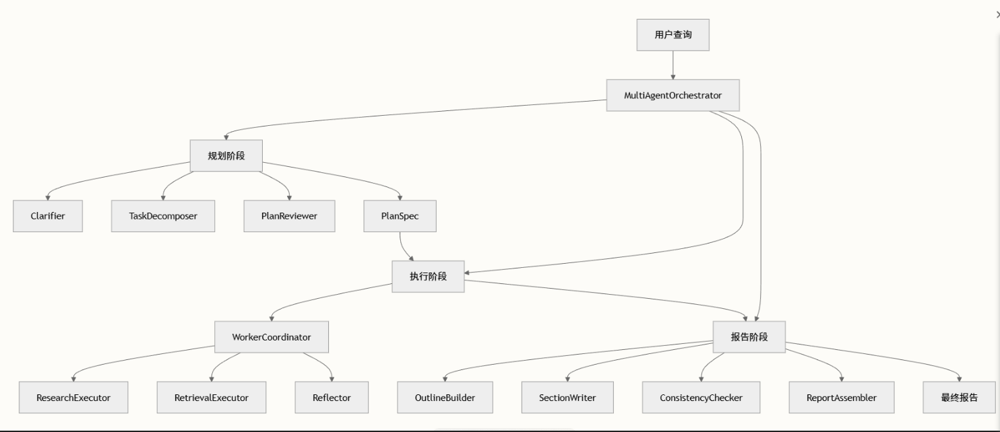

执行器有一个设计是：
串行：任务之间**存在依赖**。例如：任务B（总结文章）必须等任务A（下载文章）完成后才能开始。
并行：任务之间**没有依赖关系**。例如：同时搜索“百度的股价”和“腾讯的股价”


 相似实体检测器，使用Neo4j GDS库实现实体相似性分析和社区识别。
 **主要功能：**
 **建立实体投影图：**创建“实体的内存投影子图”，不是为了存储，而是为了“可控、高效、可计算地做推理与召回”。如果不做这一步，你的系统只能“查数据”，而做不了 **图级语义推理**。

 **使用KNN算法识别相似实体**：


 **社区感知搜索结合**：是Agent的设计哲学，表明了在搜索前，不急着进行搜索，先花点代价想想怎么进行搜索。

- **Community-aware Search → 降低探索空间**
- **Chain-of-Exploration → 发现隐性线索**
- **多级缓存 → 控制系统成本**
- **搜索策略回写 → 提升后续召回质量**


```
def enhance_search_with_coe(tool, query: str, keywords: Dict[str, List[str]]):
    """
    使用社区感知搜索结合 Chain-of-Exploration 结果对查询进行增强。
    该函数与旧版 `_enhance_search_with_coe` 逻辑一致，通过接收 `tool` 实例
    来复用其依赖对象，避免主类体积过大。
    """
    cache_key = f"coe_search:{query}"
    if hasattr(tool, "_coe_cache") and cache_key in tool._coe_cache:
        return tool._coe_cache[cache_key]
    community_context = tool.community_search.enhance_search(query, keywords)
    search_strategy = community_context.get("search_strategy", {})
    focus_entities = search_strategy.get("focus_entities", [])
    if not focus_entities:
        focus_entities = keywords.get("high_level", []) + keywords.get("low_level", [])
    if focus_entities:
        coe_cache_key = f"coe:{query}:{','.join(focus_entities[:3])}"
        if hasattr(tool, "_specific_coe_cache") and coe_cache_key in tool._specific_coe_cache:
            exploration_results = tool._specific_coe_cache[coe_cache_key]
        else:
            exploration_results = tool.chain_explorer.explore(
                query,
                focus_entities[:3],
                max_steps=3,
            )
            if not hasattr(tool, "_specific_coe_cache"):
                tool._specific_coe_cache = {}
            tool._specific_coe_cache[coe_cache_key] = exploration_results
        community_context["exploration_results"] = exploration_results
        discovered_entities = []
        for step in exploration_results.get("exploration_path", []):
            if step["step"] > 0:
                discovered_entities.append(step["node_id"])
        if discovered_entities:
            search_strategy["discovered_entities"] = discovered_entities
            community_context["search_strategy"] = search_strategy
    if not hasattr(tool, "_coe_cache"):
        tool._coe_cache = {}
    tool._coe_cache[cache_key] = community_context
    return community_context
```


**输入：**
```
query = "为什么企业级 Agent 系统需要 Router Agent？"
```

```
keywords = {
    "high_level": [
        "Agent 系统",
        "企业级架构"
    ],
    "low_level": [
        "Router Agent",
        "多智能体",
        "任务路由"
    ]
}
```

**输出：**
```
community_context = {
    "community": "Enterprise Multi-Agent Architecture",

    "search_strategy": {
        "focus_entities": [
            "Router Agent",
            "Multi-Agent Routing",
            "Task Decomposition"
        ],
        "discovered_entities": [
            "Intent Classification",
            "Skill Registry",
            "Failure Isolation"
        ],
        "intent": "architecture_reasoning"
    },

    "exploration_results": {
        "exploration_path": [
            {
                "step": 0,
                "node_id": "Router Agent",
                "reason": "用户问题直接提及"
            },
            {
                "step": 1,
                "node_id": "Intent Classification",
                "reason": "Router Agent 的核心能力之一"
            },
            {
                "step": 2,
                "node_id": "Skill Registry",
                "reason": "路由决策依赖可调用能力集合"
            },
            {
                "step": 3,
                "node_id": "Failure Isolation",
                "reason": "企业级系统引入 Router 的关键动机"
            }
        ]
    }
}
```


##### 问题一： 联通政企有不同的省分、不同的企业，其业务规则可能完全不同。你的 Agent 是一个大模型适配所有规则，还是采用了 **Router 机制分发到不同的子 Agent（对应不同企业的规则集）**？如何防止 Agent 在推理时产生‘跨企业规则串扰’？”

通过统一中控 Agent + Router + 企业/省分隔离的规则子 Agent，规则作用域 = 哪一个企业 / 哪一个省分 / 哪一套协议版本。其中每个租户对应一个agent实例，与不同的租户上下文，其中代码是一套。Router是一个确定性的裁决器（不是Agent/LLM），它根据系统可信字段，映射出唯一的租户 / 规则作用域。其中租户身份的确定是来自于登录态信息，token等，而不是来自于用户的自然语言输入，在进入agent之前就已经确定下来了，


**Router的决策结果：**
```
{
  "tenant_id": "GD_ENT_12345",
  "rule_scope": "GD_ENT_12345_v2",
  "allowed_agents": ["BillingRuleAgent"],
  "kb_namespace": "kb_gd_ent_12345",
  "graph_namespace": "graph_gd_ent_12345",
  "tool_whitelist": ["check_arrears", "load_contract", "rule_eval"]
}
```


**构造不同租户示例：**
```
agent_context = {
  "tenant_id": "GD_ENT_12345",
  "kb": KB(namespace="kb_gd_ent_12345"),
  "graph": Graph(namespace="graph_gd_ent_12345"),
  "tools": ToolRegistry(whitelist=[...]),
  "rule_scope": "GD_ENT_12345_v2"
}
```
这里注意到不同的知识图谱，是在建图的时候节点和边都带有了属性信息，便于过滤。
```
(:Rule {id, province, enterprise_id})
```


##### 问题二： 你的多 Agent 系统是基于全局共享内存（Shared Blackboard），还是基于消息传递（Message Passing）？如果是消息传递，当 Executor 执行失败后，它是如何将**‘带有技术细节的错误信息’转化为‘Planner 能理解的业务逻辑错误’**并请求重新规划的？如果json schema生成的参数不正确需不需要重新返回给planner重新执行呢？

回答：**系统采用的是“消息传递（Message Passing）”，而不是全局共享内存（Shared Blackboard）。**  Executor 的失败不会直接暴露技术异常给 Planner，而是通过一个 **Error Abstraction / Error Adapter 层**，将“技术失败”**提升（lift）**为“可规划的业务态错误”，  
再以结构化消息的形式请求 Planner 重新规划。其中参数错误不返回给planner重新执行。


**参数生成失败的形式：**
```
{
  "error_type": "PARAM_SCHEMA_ERROR",
  "origin_step_id": "step_3_generate_bss_params",
  "responsible_agent": "planner",
  "retryable": true,
  "detail": {
    "field": "effective_date",
    "expected": "YYYY-MM-DD",
    "actual": "2025/01/26"
  }
}
```


**返回给planner，需要重新规划的格式：**
```
{
  "event": "EXECUTION_FAILED",
  "failure_mode": "PARAM_INVALID",
  "hint": "Parameter format mismatch",
  "action_required": "REGENERATE_PARAMS",
  "constraints": {
    "effective_date": "must follow YYYY-MM-DD"
  }
}
```


为了加速推理，提高响应速度，**可缓存的典型前缀：**
- 系统角色定义（Agent persona）
- 企业级规则总纲（不会每次变）
- Schema 定义（JSON Schema、Tool Spec）
- 固定安全约束（不能跨省、不能越权）
**这种在1000次的查询中，900次会相同。**


**是否用 Qwen-7B 替代元景大模型做简单参数提取？是，而且必须。**
