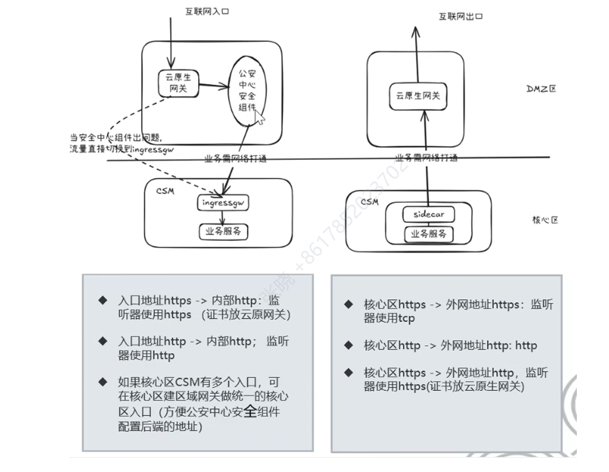

``
###  StatefulSet
#### **创建 3 个 Nginx，给它们编好号（0,1,2），并且允许直接通过名字找到具体的某一个，而不是随机访问。**
```
# 1. 定义 Headless Service
apiVersion: v1
kind: Service
metadata:
  name: nginx-svc      # 【关键】服务名称，将作为 DNS 域名的一部分
  labels:
    app: nginx
spec:
  ports:
  - port: 80
    name: web
  clusterIP: None      # 【关键】必须设置为 None，这就是 "Headless" 的由来
  selector:
    app: nginx
---
# 2. 定义 StatefulSet
apiVersion: apps/v1
kind: StatefulSet
metadata:
  name: web            # 【关键】StatefulSet 名称，将作为 Pod 名字的前缀
spec:
  serviceName: "nginx-svc" # 【关键】必须指向上面创建的 Headless Service 名称
  replicas: 3
  selector:
    matchLabels:
      app: nginx
  template:
    metadata:
      labels:
        app: nginx
    spec:
      containers:
      - name: nginx
        image: nginx:1.21
        ports:
        - containerPort: 80
          name: web
```

**用户只能访问 nginx-svc，K8s 会做一个负载均衡，把你的请求随机扔给 web-0、web-1 或 web-2。**


#### **Pod 可以死，但它绑定的“硬盘”（PVC）永远属于它，数据不会丢，也不会乱**


```
apiVersion: apps/v1
kind: StatefulSet
metadata:
  name: web
spec:
  serviceName: "nginx"
  replicas: 2
  selector:
    matchLabels:
      app: nginx
  template:
    metadata:
      labels:
        app: nginx
    spec:
      containers:
      - name: nginx
        image: nginx
        ports:
        - containerPort: 80
          name: web
        volumeMounts:
        - name: www
          mountPath: /usr/share/nginx/html # 挂载点
  # 【核心配置：动态申请存储】
  volumeClaimTemplates:
  - metadata:
      name: www
    spec:
      accessModes: [ "ReadWriteOnce" ]
      storageClassName: "standard" # 假设集群有这个默认存储类
      resources:
        requests:
          storage: 1Gi
```

**差异化的数据，但是删除后。pod挂载的数据不会被删除。**
```
kubectl exec web-1 -- sh -c 'echo "我是 web-1 的独家数据" > /usr/share/nginx/html/index.html'
```

```
kubectl exec web-1 -- sh -c 'echo "我是 web-1 的独家数据" > /usr/share/nginx/html/index.html'
```


###  Ingress

**Service 的NodePort/LoadBalancer可以暴露端口，为什么还需要Ingress？**
- **Service (Layer 4 - 传输层)**：
    - 工作在 TCP/UDP 层。
    - 它只能感知 **IP 和端口**。
    - 它**看不懂** HTTP 协议（比如 URL 路径 /api、域名 foo.com）。
    - **痛点**：如果你有 10 个微服务想暴露给外网，用 Service 的 LoadBalancer 模式，你需要向云厂商购买 10 个公网 IP（既贵又难管理）。  
- **Ingress (Layer 7 - 应用层)**：
    - 工作在 HTTP/HTTPS 层。
    - 它能感知 **域名 (Host)** 和 **路径 (Path)**。
    - **优势**：它是 K8s 的“智能路由”。你可以只用 **1 个公网 IP**，通过域名和路径区分，把流量转发给后端几十个不同的 Service。

**下面是一个通过ingress进行配置，并通过域名进行访问的示例**
```
apiVersion: networking.k8s.io/v1
kind: Ingress
metadata:
  name: simple-fanout
spec:
  ingressClassName: nginx  # 指定使用 Nginx 控制器
  rules:
  - host: my-shop.com      # 域名
    http:
      paths:
      - path: /mall        # 路径前缀
        pathType: Prefix
        backend:
          service:
            name: mall-service
            port:
              number: 80
      - path: /order       # 另一个路径
        pathType: Prefix
        backend:
          service:
            name: order-service
            port:
              number: 80
```


### ConfigMap： **解耦（Decoupling）**

**ConfigMap，Pod 里的配置不会立刻发生变换，需要重启Pod**

**ConfigMap**
```
apiVersion: v1
kind: ConfigMap
metadata:
  name: game-demo-config
  namespace: default
data:
  # Key-Value 形式 (适合环境变量)
  player_initial_lives: "3"
  ui_properties_file_name: "user-interface.properties"

  # 文件内容形式 (适合配置文件)
  game.properties: |
    enemy.types=aliens,monsters
    player.maximum-lives=5
    secret.code.lives=30
```


**Volume**，进行配置的关联
```
spec:
  containers:
    - name: game-demo
      image: game-demo:v1
      volumeMounts:
      - name: config-volume
        mountPath: /config  # 挂载路径
  volumes:
    - name: config-volume
      configMap:
        name: game-demo-config # 引用 CM
        # 结果：容器内的 /config 目录下会出现一个名为 game.properties 的文件
```


#### Envoy云原生网关

区别于传统的静态网关，实现热更新，Nginx


流量转发：


切流网关需要设计两个不同的云原生网关，分别连接两个不同的区域
```
listeners:
- name: http_listener
  address:
    socket_address:
      address: 0.0.0.0
      port_value: 80        # Envoy 在本机 **80端口**监听请求
  filter_chains:
  - filters:
    - name: envoy.filters.network.http_connection_manager
      typed_config:
        route_config:
          virtual_hosts:
          - name: service
            domains: ["*"]
            routes:
            - match:
                prefix: "/api"  # 只要请求路径以 /api 开头
              route:
                cluster: service_cluster   # 把请求转发到 service_cluster
```

**Envoy 通过 Listener 接收请求，经由 FilterChain 处理后，根据 Route 规则匹配到目标 Cluster，实现七层路由转发。**

超时重试

限流熔断

认证鉴权

指标监控

日志分析


